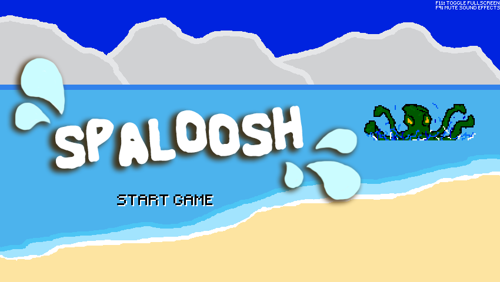
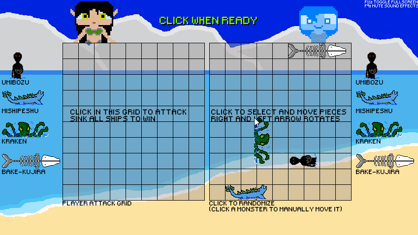

# Spaloosh!

## About
Spaloosh is a take on the traditional battleship game using a monster theme instead of battleships. Originally created for the [Maximum Monster Month](https://itch.io/jam/maximum-monster-month) game jam on [itch.io](https://itch.io). It is written in Go using [Ebiten](https://github.com/hajimehoshi/ebiten) for a 2D framework. All "artwork" was drawn by myself. The idea was to challenge myself to make a "full" game from scratch all by myself, that included using no established game engines.

## Features
* Two different game modes
  * Race against the clock to sink 3 monsters with limited bombs. Includes 2 difficulty levels
  * Battle against the AI in traditional battleship style matches.
* Online Multiplayer Matches
  * Direct IP connection
  * Server Rooms available (players may host their own servers with the provided code)
* Multiple Characters to choose from (all need a backstory though that is in progress)
* Cross Platform
  * Since the entire game is written using the Go language it can easily be cross compiled to all major operating systems
  
## That's great, but I just want to play it!
OK, I hear you, compiling games isn't nearly as fun as playing them!

The game can be downloaded from itch.io here: [Spaloosh!](https://atolverderben.itch.io/spaloosh)

 
 

  